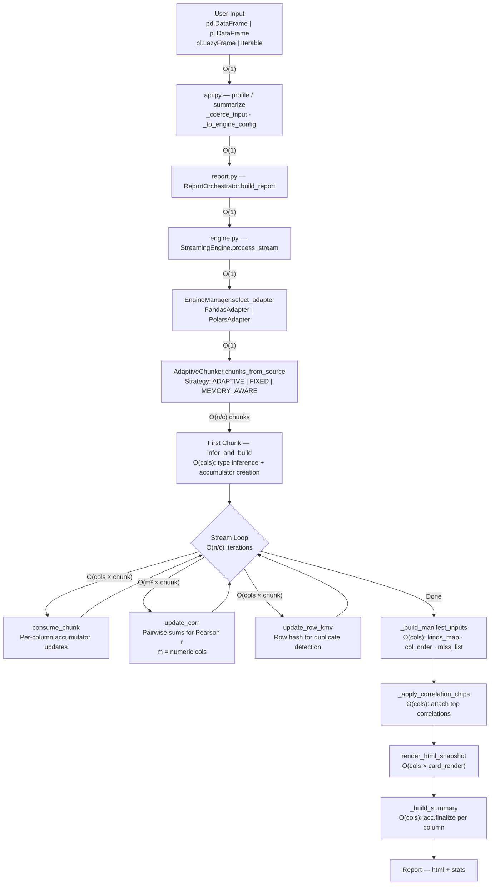
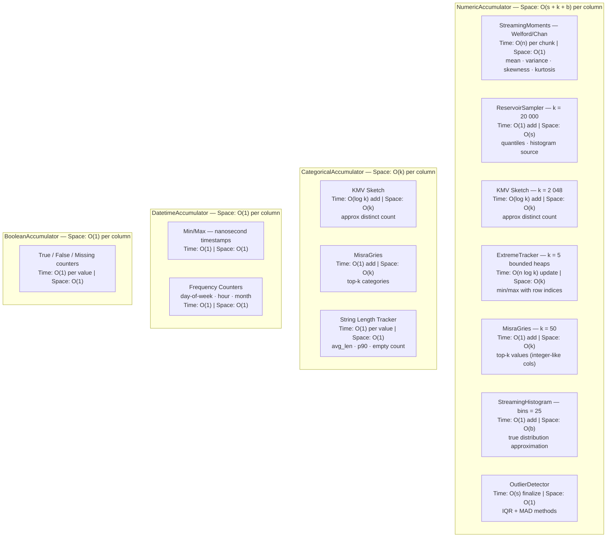
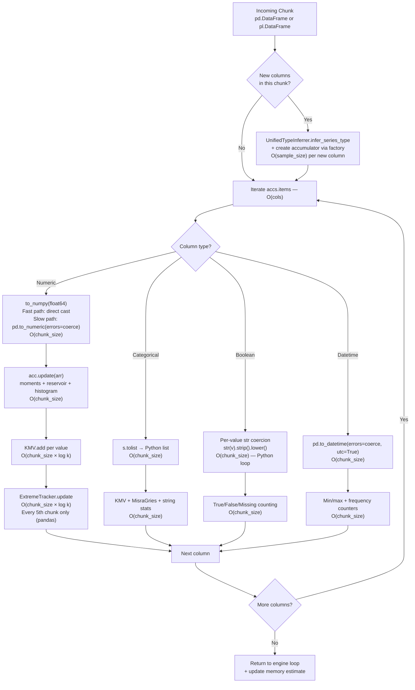
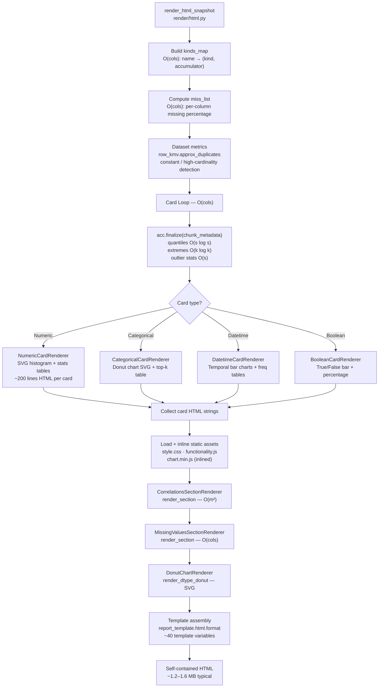

# Architecture Diagrams

Visual reference for PySuricata's processing pipeline, accumulator internals, chunk processing, and rendering — annotated with algorithmic complexity.

---

## 1. Main Processing Pipeline

End-to-end data flow from user input to final `Report` object.

### Complexity Summary

| Metric | Value |
|--------|-------|
| **Total Time** | O(n_rows × n_cols) + O(m² × n_rows) for correlations |
| **Total Space** | O(cols × (s + k + b)) |
| **Peak Memory** | ~50 MB bounded by streaming architecture |

Where: `n` = total rows, `c` = chunk size (200k default), `m` = numeric columns, `s` = reservoir size (20k), `k` = KMV sketch size (2048), `b` = histogram bins (25).

---

## 2. Accumulator Architecture

Each column type has a specialized accumulator with small, bounded state.

### Per-Column Memory Budget

| Accumulator | Default Config | Approx Memory |
|-------------|---------------|---------------|
| NumericAccumulator | s=20k, k=2048, b=25 | ~170 KB |
| CategoricalAccumulator | k=2048+50 | ~20 KB |
| DatetimeAccumulator | — | < 1 KB |
| BooleanAccumulator | — | < 1 KB |

---

## 3. Chunk Processing Detail

What happens inside `consume_chunk()` for each column in a chunk.

### Per-Chunk Bottleneck Analysis

| Operation | Complexity | Notes |
|-----------|-----------|-------|
| Numeric KMV loop | O(chunk × log k) | Per-value Python → batch vectorizable |
| Boolean coercion | O(chunk) Python | str conversion per value → vectorizable |
| Correlation update | O(m² × chunk) | Pairwise; gated by `corr_max_cols=50` |
| Row KMV hashing | O(chunk × cols) | Per-row tuple hashing → vectorizable |
| Type conversion | O(chunk) | pd.to_numeric / pd.to_datetime |

---

## 4. Rendering Pipeline

How the final HTML report is assembled from accumulated statistics.

### Rendering Cost Breakdown

| Phase | Complexity | Output Size |
|-------|-----------|-------------|
| Finalization | O(cols × s log s) | — |
| Card rendering | O(cols) | ~5–20 KB per card |
| Asset inlining | O(1) | ~200 KB (CSS+JS) |
| Correlation section | O(m²) | Variable |
| Template assembly | O(1) | ~1.2–1.6 MB total |

---

## 5. End-to-End Complexity Table

| Stage | Time | Space | Key Parameter |
|-------|------|-------|---------------|
| Input coercion | O(1) | O(1) | — |
| Chunking | O(n/c) | O(c × cols) | `chunk_size` (200k) |
| Type inference | O(sample) | O(1) | first chunk only |
| Accumulator updates | O(n × cols) | O(cols × s) | `numeric_sample_k` (20k) |
| KMV sketching | O(n × log k) | O(cols × k) | `uniques_k` (2048) |
| Correlation | O(n × m²) | O(m²) | `corr_max_cols` (50) |
| Row deduplication | O(n × cols) | O(k) | KMV sketch |
| Finalization | O(cols × s log s) | O(cols) | — |
| HTML rendering | O(cols) | O(report_size) | ~1.5 MB |
| **Total** | **O(n × cols + n × m²)** | **O(cols × s)** | — |
