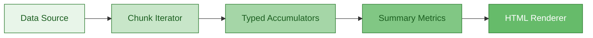
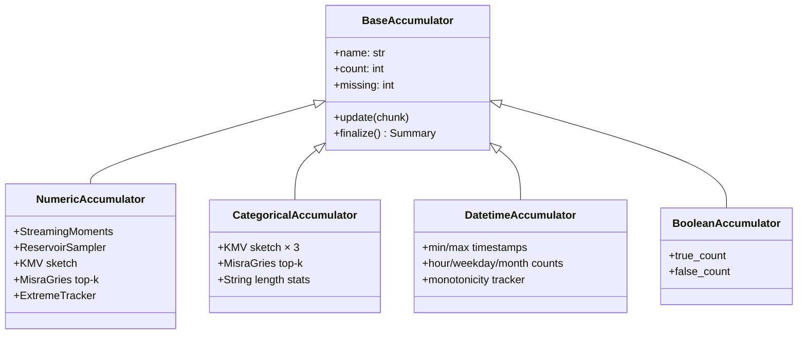
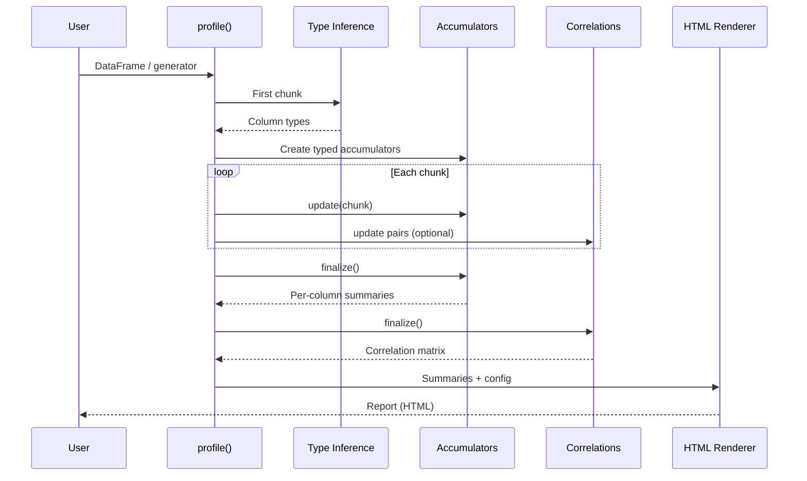
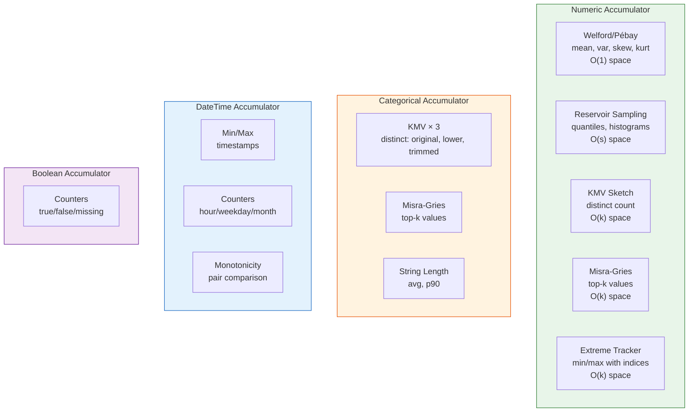
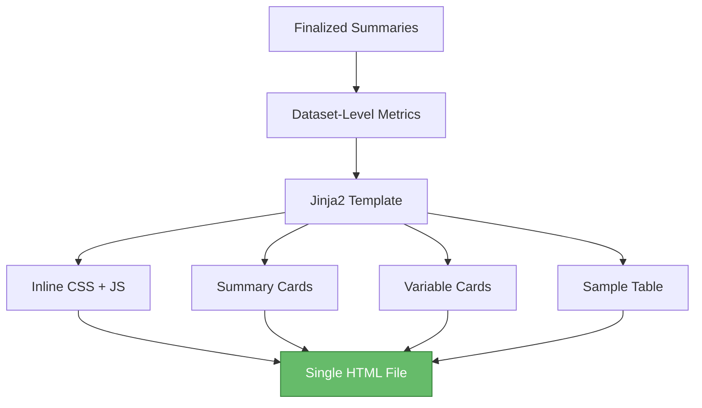

# Architecture & Internals

How `pysuricata` profiles data efficiently and renders a self-contained HTML report.

## High-Level Pipeline

**Data Sources** → pandas DataFrames, polars DataFrames, or any iterable of DataFrames (for streaming).

**Chunk Iterator** → If a single DataFrame is passed, it is treated as one chunk. Generators are consumed chunk-by-chunk to bound memory.

**Typed Accumulators** → Each column is assigned a specialized accumulator based on its inferred type. All accumulators are streaming: they accept one chunk at a time and maintain bounded state.

**Summary Metrics** → After all chunks are consumed, accumulators are finalized and dataset-wide metrics (missingness, duplicates, etc.) are computed.

**HTML Renderer** → A single-file Jinja2 template with inline CSS/JS produces a portable, self-contained HTML report.

---

## Accumulator Architecture

Each accumulator follows the same interface:

1. **`update(chunk)`** — process a batch of values, update internal state
2. **`finalize()`** — compute final statistics from accumulated state

---

## Data Flow

---

## Streaming Algorithms

Each accumulator uses algorithms chosen for **O(1) per-value update** and **bounded memory**:

---

## Rendering Pipeline

The template produces a **single portable HTML file** — no external dependencies, no server required.

**Summary cards** show: rows, columns, processed bytes, missing %, duplicates %.

**Variable cards** are rendered per-type with SVG charts, statistics, and quality flags.

### Shared Utilities

| Module | Functions | Purpose |
|--------|-----------|---------|
| `render/svg_utils.py` | `safe_col_id`, `nice_ticks`, `fmt_tick`, `svg_empty` | SVG chart helpers |
| `render/format_utils.py` | `human_bytes`, `fmt_num`, `fmt_compact` | Number formatting |

---

## Configuration

`ReportConfig` controls all behavior:

| Parameter | Default | Effect |
|-----------|---------|--------|
| `chunk_size` | 200,000 | Rows per chunk |
| `numeric_sample_size` | 20,000 | Reservoir size for quantiles |
| `uniques_sketch_size` | 2,048 | KMV sketch size |
| `top_k_size` | 50 | Misra-Gries capacity |
| `compute_correlations` | `True` | Enable/disable correlation chips |
| `corr_threshold` | 0.5 | Minimum \|r\| to display |
| `random_seed` | `None` | Deterministic sampling |
| `include_sample` | `True` | Include data sample in report |

---

## Security & Correctness

- **HTML escaping** — column names and labels are escaped before rendering
- **Missing/Inf handling** — NaN and ±Inf excluded from moments, reported separately
- **Approximation badges** — estimates marked with `(≈)` or `approx` badge
- **Reproducibility** — set `random_seed` for deterministic results

## Extending

- **Backends** — polars/Arrow/DuckDB can be connected via the chunk iterator interface
- **Quantile sketches** — t-digest or KLL can replace the default reservoir
- **New sections** — drift comparisons, JSON export, CLI wrapper
