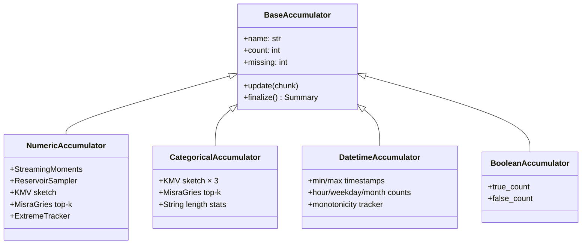
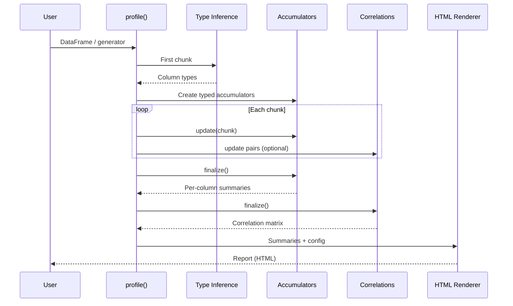
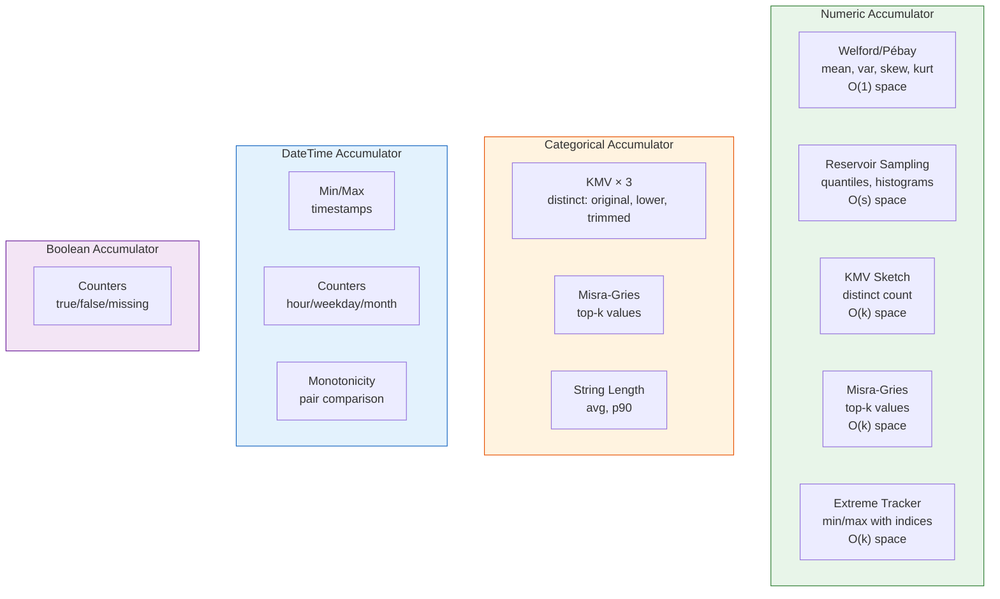
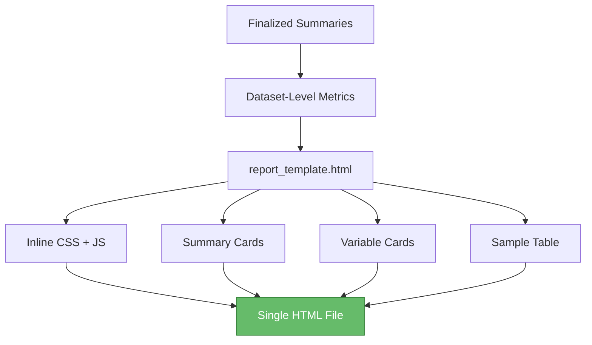

# Architecture & Internals

How `pysuricata` profiles data efficiently and renders a self-contained HTML report.

## High-Level Pipeline

<figure class="ps-figure" markdown="0">
  <iframe src="../assets/diagrams/figures.html?only=chunk-lifecycle" title="The chunk lifecycle: which state is bounded and which is released" loading="lazy"></iframe>
</figure>

```mermaid
flowchart LR
    A["Data Source"] --> B["Chunk Iterator"]
    B --> C["Typed Accumulators"]
    C --> D["Summary Metrics"]
    D --> E["HTML Renderer"]

    style A fill:#E8F5E9,stroke:#2E7D32,color:#1B5E20
    style B fill:#C8E6C9,stroke:#2E7D32,color:#1B5E20
    style C fill:#A5D6A7,stroke:#2E7D32,color:#1B5E20
    style D fill:#81C784,stroke:#2E7D32,color:#1B5E20
    style E fill:#66BB6A,stroke:#2E7D32,color:#fff
```

**Data Sources** → pandas or polars frames; a path to a CSV, Parquet, JSON or
Arrow IPC file; an Arrow table or reader, or anything exporting
`__arrow_c_stream__`; a DuckDB relation; or any iterable of frames. The middle
three are read a batch at a time and never materialised.

**Chunk Iterator** → If a single DataFrame is passed, it is treated as one chunk. Generators are consumed chunk-by-chunk to bound memory.

**Typed Accumulators** → Each column is assigned a specialized accumulator based on its inferred type. All accumulators are streaming: they accept one chunk at a time and maintain bounded state.

**Summary Metrics** → After all chunks are consumed, accumulators are finalized and dataset-wide metrics (missingness, duplicates, etc.) are computed.

**HTML Renderer** → One template, `templates/report_template.html`, carrying
bare `{identifier}` placeholders — no templating engine and no dependency for
one. They are filled in a **single regex pass**, not by `str.format` and not by
sequential `replace()`, and both halves of that matter: the inlined CSS and JS
contain braces (`{--var-name}`, every JS block) that `.format()` would read as
placeholders and raise `KeyError` on, while sequential replacement would rescan
a value it had already substituted — a user-supplied title containing
`{report_date}` would be expanded by a later pass. CSS, JS and SVG are inlined,
producing a portable, self-contained file.

---

## Accumulator Architecture

```mermaid
classDiagram
    class BaseAccumulator {
        +name: str
        +count: int
        +missing: int
        +update(chunk)
        +finalize() Summary
    }

    class NumericAccumulator {
        +StreamingMoments
        +ReservoirSampler
        +KMV sketch
        +MisraGries top-k
        +ExtremeTracker
    }

    class CategoricalAccumulator {
        +KMV sketch × 3
        +MisraGries top-k
        +String length stats
    }

    class DatetimeAccumulator {
        +min/max timestamps
        +hour/weekday/month counts
        +monotonicity tracker
    }

    class BooleanAccumulator {
        +true_count
        +false_count
    }

    BaseAccumulator <|-- NumericAccumulator
    BaseAccumulator <|-- CategoricalAccumulator
    BaseAccumulator <|-- DatetimeAccumulator
    BaseAccumulator <|-- BooleanAccumulator
```

Each accumulator follows the same interface:

1. **`update(values)`** — fold a batch of values into internal state. The
   accumulator never sees a frame, only an array; the adapter has already
   converted the column
2. **`merge(other)`** — combine two partial states into one
3. **`finalize()`** — compute final statistics from accumulated state

`merge` is the one the whole design rests on. Because it exists and is exact,
**chunked results equal unchunked results** — an invariant asserted in
`benchmarks/accuracy.py`, and the thing most likely to break.

---

## Data Flow

```mermaid
sequenceDiagram
    participant User
    participant profile as profile()
    participant Infer as Type Inference
    participant Acc as Accumulators
    participant Corr as Correlations
    participant Render as HTML Renderer

    User->>profile: DataFrame / generator
    profile->>Infer: First chunk
    Infer-->>profile: Column types
    profile->>Acc: Create typed accumulators

    loop Each chunk
        profile->>Acc: update(chunk)
        profile->>Corr: update pairs (optional)
    end

    profile->>Acc: finalize()
    Acc-->>profile: Per-column summaries
    profile->>Corr: finalize()
    Corr-->>profile: Correlation matrix

    profile->>Render: Summaries + config
    Render-->>User: Report (HTML)
```

---

## Streaming Algorithms

Each accumulator uses algorithms chosen for **O(1) per-value update** and **bounded memory**:

```mermaid
flowchart TB
    subgraph Numeric["Numeric Accumulator"]
        N1["Welford/Pébay<br/>mean, var, skew, kurt<br/>O(1) space"]
        N2["Reservoir Sampling<br/>quantiles, histograms<br/>O(s) space"]
        N3["KMV Sketch<br/>distinct count<br/>O(k) space"]
        N4["Misra-Gries<br/>top-k values<br/>O(k) space"]
        N5["Extreme Tracker<br/>min/max with indices<br/>O(k) space"]
    end

    subgraph Categorical["Categorical Accumulator"]
        C1["KMV × 3<br/>distinct: original, lower, trimmed"]
        C2["Misra-Gries<br/>top-k values"]
        C3["String Length<br/>avg, p90"]
    end

    subgraph DateTime["DateTime Accumulator"]
        D1["Min/Max<br/>timestamps"]
        D2["Counters<br/>hour/weekday/month"]
        D3["Monotonicity<br/>pair comparison"]
    end

    subgraph Boolean["Boolean Accumulator"]
        B1["Counters<br/>true/false/missing"]
    end

    style Numeric fill:#E8F5E9,stroke:#2E7D32
    style Categorical fill:#FFF3E0,stroke:#E65100
    style DateTime fill:#E3F2FD,stroke:#1565C0
    style Boolean fill:#F3E5F5,stroke:#6A1B9A
```

---

## Rendering Pipeline

```mermaid
flowchart TB
    A["Finalized Summaries"] --> B["Dataset-Level Metrics"]
    B --> C["report_template.html"]
    C --> D["Inline CSS + JS"]
    C --> E["Summary Cards"]
    C --> F["Variable Cards"]
    C --> G["Sample Table"]
    D --> H["Single HTML File"]
    E --> H
    F --> H
    G --> H

    style H fill:#66BB6A,stroke:#2E7D32,color:#fff
```

The template produces a **single portable HTML file** — no external dependencies, no server required.

**Summary cards** show: rows, columns, processed bytes, missing %, duplicates %.

**Variable cards** are rendered per-type with SVG charts, statistics, and quality flags.

### Shared Utilities

| Module | Functions | Purpose |
|--------|-----------|---------|
| `render/svg_utils.py` | `safe_col_id`, `nice_ticks`, `fmt_tick`, `svg_empty` | SVG chart helpers |
| `render/format_utils.py` | `human_bytes`, `fmt_num`, `fmt_compact` | Number formatting |

---

## Configuration

`ProfileConfig` controls all behavior:

| Parameter | Default | Effect |
|-----------|---------|--------|
| `chunk_size` | 50,000 | Rows per chunk |
| `numeric_sample_size` | 20,000 | Reservoir size for quantiles |
| `max_uniques` | 2,048 | KMV sketch size |
| `top_k` | 50 | Misra-Gries capacity |
| `compute_correlations` | `True` | Enable/disable correlation chips |
| `corr_threshold` | 0.5 | Minimum \|r\| to display |
| `random_seed` | `0` | Deterministic sampling — reproducible unless you ask otherwise |
| `render.include_sample` | `True` | Show sample rows (the table only — cards still print labels and extremes) |

---

## Security & Correctness

- **HTML escaping** — column names and labels are escaped before rendering
- **Missing/Inf handling** — NaN and ±Inf excluded from moments, reported separately
- **Approximation badges** — estimates marked with `(≈)` or `approx` badge
- **Reproducibility** — set `random_seed` for deterministic results

## Extending

Where the seams are, and what already sits in them.

**Already connected through the chunk iterator.** polars, Arrow (anything
exporting `__arrow_c_stream__`) and DuckDB relations are adapters over the same
interface — `pysuricata/sources.py` and `compute/adapters/`. A new backend is a
new reader yielding frames, not a change to the engine.

**Already built on the summary payload.** `summarize()` and `Report.save_json()`
are the JSON export; `compare()` is the drift comparison; `pysuricata check` is
the gate. All three read the same finalized summaries the renderer does, which
is why a gate and a diff cannot disagree about what a number means.

**Still open:**

- **Quantile sketches** — t-digest or KLL could replace the reservoir, trading a
  fixed error bound for a distribution-dependent one
- **A native core** — the accumulator boundary was prepared for a second
  implementation in Rust and measured at 0.97–1.01x, so the preparation cost
  nothing ([#44](https://github.com/alvarodiez20/pysuricata/issues/44))
- **The column axis** — state is per column at roughly 529 KB each, so bounded
  memory is a claim about rows and not yet about columns
  ([#207](https://github.com/alvarodiez20/pysuricata/issues/207))
- **An HTML view for `compare()`**
  ([#121](https://github.com/alvarodiez20/pysuricata/issues/121))
