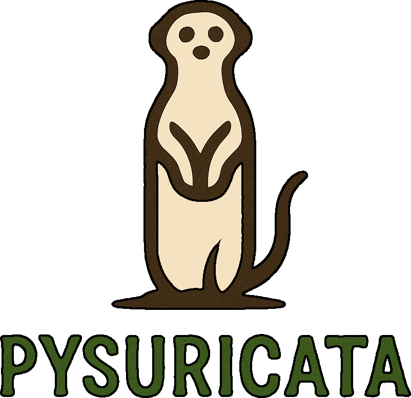

<div align="center">
  
</div>

[](https://github.com/alvarodiez20/pysuricata/actions)
[](https://pypi.org/project/pysuricata/)
[](https://github.com/alvarodiez20/pysuricata)
[](LICENSE)
[](https://codecov.io/gh/alvarodiez20/pysuricata)
[](https://alvarodiez20.github.io/pysuricata/)
[](https://pepy.tech/project/pysuricata)

# PySuricata

**Exploratory data analysis for Python, built on streaming algorithms.**

PySuricata generates self-contained HTML reports for pandas and polars DataFrames. It processes data in chunks using streaming algorithms, so memory usage stays bounded regardless of dataset size.

[**Try it in your browser**](https://pysuricata.pages.dev) with no install: drop a CSV, Parquet file or Excel workbook and get the real report back. The profiler is compiled to WebAssembly and runs in the page, so nothing is uploaded.

<div class="grid cards" markdown>

-   **Live Demo**

    ---

    Profile your own file in a browser tab. No install, no upload.

    [:octicons-arrow-right-24: Open the Demo](https://pysuricata.pages.dev)

-   **Quick Start**

    ---

    Install PySuricata and generate your first report.

    [:octicons-arrow-right-24: Get Started](quickstart.md)

-   **Why PySuricata?**

    ---

    Understand the streaming architecture and design decisions.

    [:octicons-arrow-right-24: Learn More](why-pysuricata.md)

-   **User Guide**

    ---

    Detailed guides for configuration, advanced features, and more.

    [:octicons-arrow-right-24: Read the Guide](usage.md)

-   **API Reference**

    ---

    `profile()`, `summarize()`, `compare()` and every option they take.

    [:octicons-arrow-right-24: API Docs](api.md)

</div>

## Features

- **Streaming processing** — Data is processed in configurable chunks, keeping memory bounded in rows regardless of dataset size. Useful for datasets that don't fit in RAM.
- **Reads a source, not just a frame** — A path, an Arrow table or reader, anything exporting `__arrow_c_stream__`, or a DuckDB relation, all a batch at a time and never materialised. 307 MB against 581 MB on a 180 MB Parquet file.
- **Numbers without the HTML** — `summarize()` returns the same statistics as a **versioned** JSON payload, so a consumer can read it without parsing a report.
- **A gate, not just a report** — `pysuricata check` compares a dataset against a stored baseline and exits non-zero when a threshold is crossed, so the same single pass runs in a notebook and in CI.
- **A diff between two datasets** — `compare(a, b)` reports every delta: schema, dataset and per column, with the approximate ones marked.
- **Mathematically grounded** — Welford's algorithm for numerically stable moments, Pébay's formulas for mergeable statistics, KMV sketches for distinct counts, Misra-Gries for heavy hitters — each with its error bound published rather than hidden.
- **Pandas and Polars support** — Works natively with both `pandas.DataFrame` and `polars.DataFrame` / `polars.LazyFrame`.
- **Self-contained reports** — A single HTML file with inline CSS, JS and SVG charts. No external assets or dependencies needed to view.
- **Reproducible by default** — The seed is `0`, not `None`, so re-running over unchanged data is a no-op rather than a set of sampling wobbles.

## Installation

=== "uv (Recommended)"

    ```bash
    uv add pysuricata
    ```

=== "pip"

    ```bash
    pip install pysuricata
    ```

This installs PySuricata along with its dependencies: **pandas**, **numpy** (on Python ≥3.13), and **markdown**.

To also install polars support:

```bash
pip install pysuricata[polars]
```

## Quick Example

```python
import pandas as pd
from pysuricata import profile

# Two years of hourly bike rentals — a timestamp, two booleans, two
# categoricals, and numeric columns that genuinely correlate.
url = "https://raw.githubusercontent.com/alvarodiez20/pysuricata/main/docs/assets/bike_sharing.csv"
df = pd.read_csv(url, parse_dates=["rented_at"])

# Generate report
report = profile(df)
report.save_html("example_report.html")
```

Or from a shell, without writing a script:

```bash
pysuricata profile bike_sharing.csv --output example_report.html
```

This is the actual report generated from the code above (17,379 rows × 12 columns):

<div style="border: 2px solid #7CB342; border-radius: 8px; overflow: hidden; margin: 2rem 0;">
  <iframe src="assets/example_report.html" width="100%" height="800px" style="border: none;"></iframe>
</div>

<div align="center">
  <p><em>Can't see the report? <a href="assets/example_report.html" target="_blank">Open in new tab →</a></em></p>
</div>

## How It Works

PySuricata reads data in chunks and updates lightweight accumulators for each column. This means:

| Aspect | Approach |
|--------|----------|
| **Memory** | Bounded by chunk size + accumulator state, not dataset size |
| **Speed** | Single pass over the data — each row is read once |
| **Accuracy** | Exact for moments (mean, variance, skewness, kurtosis); approximate with known error bounds for distinct counts and top-k |
| **Mergeability** | Accumulators can be merged across chunks or machines |

Memory is bounded **in rows**. It is not bounded in columns: state is per
column at roughly 529 KB each, and a 20,000 x 600 frame peaks at 631 MB against
344 MB for a 1,000,000 x 14 one on more cells. That is a known limit, tracked in
[#207](https://github.com/alvarodiez20/pysuricata/issues/207).

Reports include per-column statistics, histograms, correlation chips, missing value analysis, outlier detection, and more — all computed during the single streaming pass.

## Beyond the Report

<div class="grid cards" markdown>

-   **Gate a build on drift**

    ---

    `pysuricata check` compares against a stored baseline and exits non-zero
    when a threshold is crossed.

    [:octicons-arrow-right-24: Gating CI on drift](data-checks.md)

-   **Read a source, not a frame**

    ---

    Parquet, Arrow IPC and DuckDB relations, a batch at a time.

    [:octicons-arrow-right-24: Arrow, Parquet and DuckDB](data-sources.md)

-   **Diff two datasets**

    ---

    `compare(a, b)` reports every delta, with the approximate ones marked.

    [:octicons-arrow-right-24: Comparing two datasets](comparing.md)

-   **Read the numbers directly**

    ---

    A versioned JSON payload with no HTML in the way.

    [:octicons-arrow-right-24: The summarize() schema](summary-schema.md)

</div>

## Next Steps

<div class="grid cards" markdown>

-   **New to PySuricata?**

    Start with the [Quick Start Guide](quickstart.md)

-   **Want specific examples?**

    Check the [Examples Gallery](examples.md)

-   **Interested in the algorithms?**

    Explore [Statistical Methods](stats/overview.md)

-   **Want to contribute?**

    Read the [Contributing Guide](contributing.md)

</div>

## Community & Support

- [GitHub Discussions](https://github.com/alvarodiez20/pysuricata/discussions)
- [Issue Tracker](https://github.com/alvarodiez20/pysuricata/issues)
- [Star on GitHub](https://github.com/alvarodiez20/pysuricata)

## License

MIT License. See [LICENSE](https://github.com/alvarodiez20/pysuricata/blob/main/LICENSE) for details.
