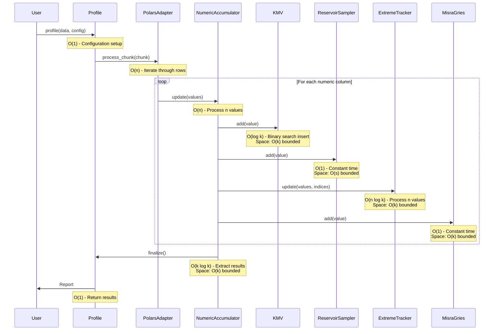
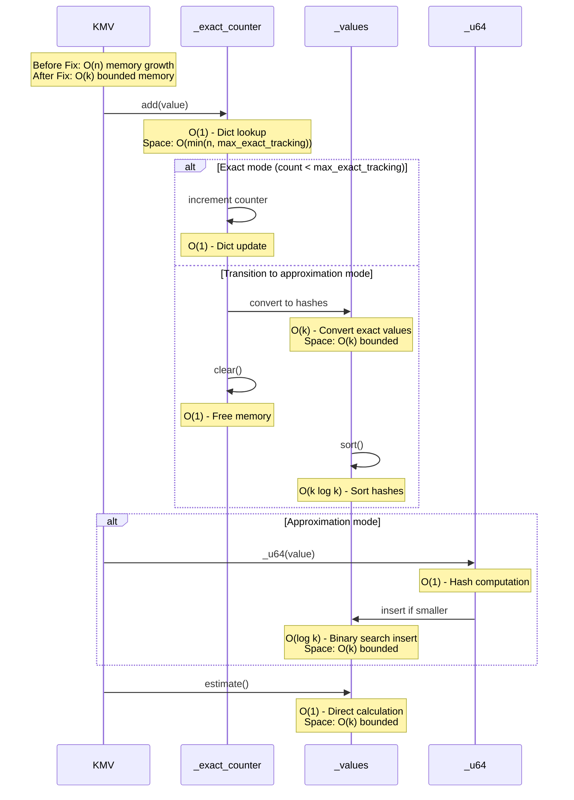
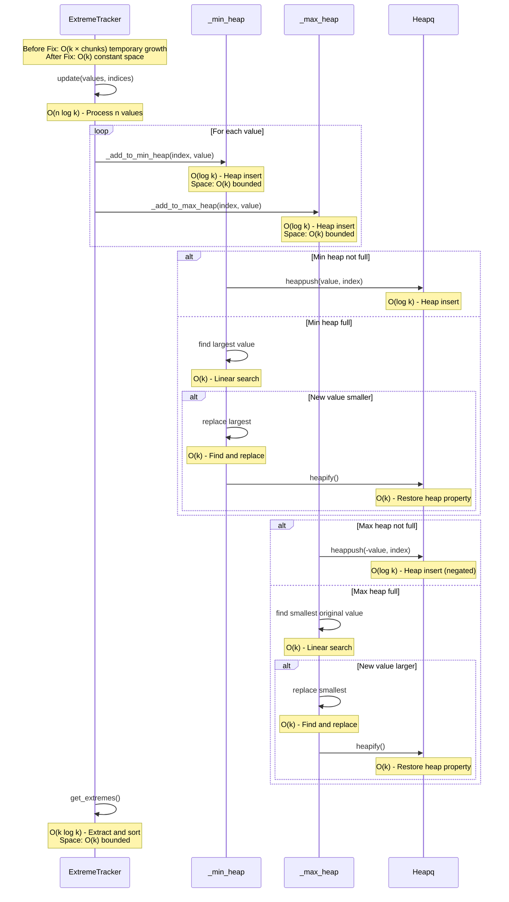
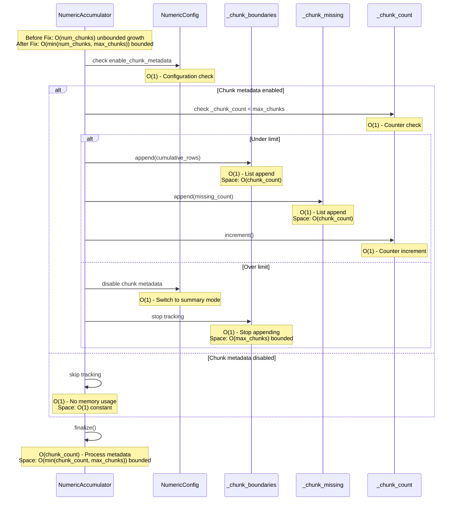
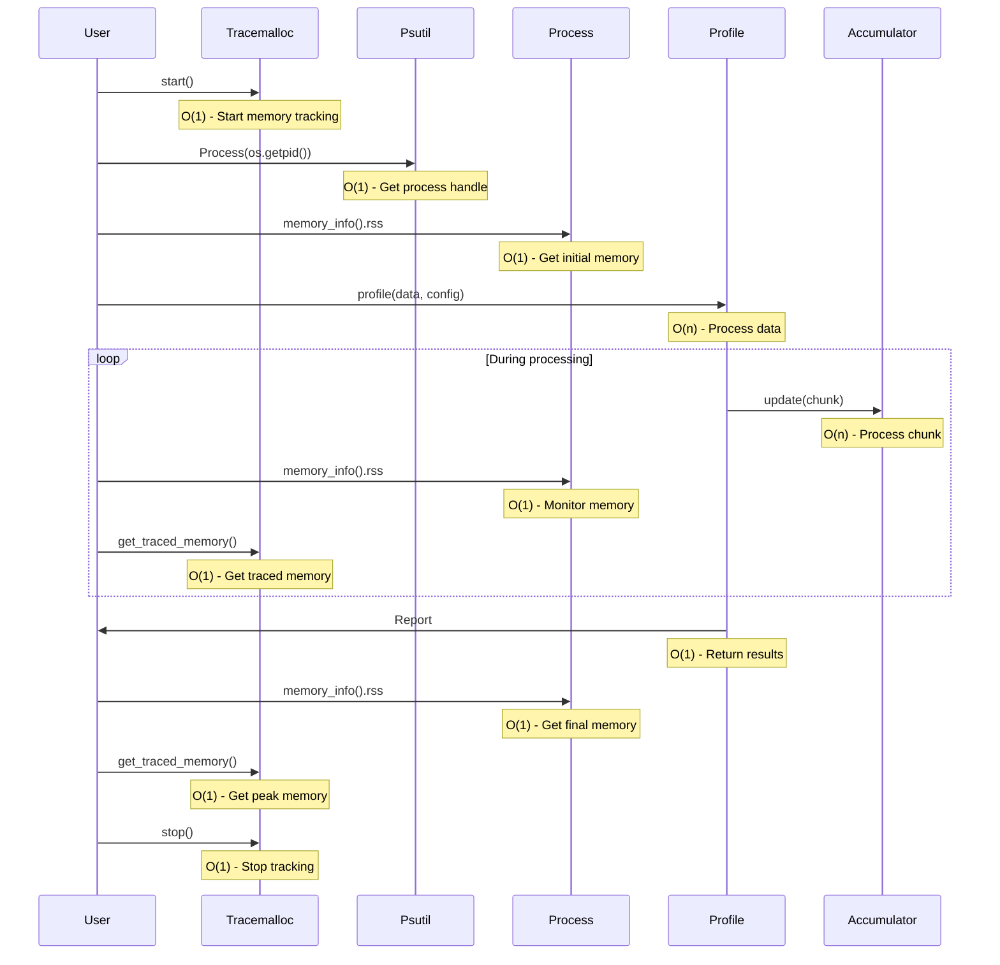

# Annotated Sequence Diagrams with Complexity Analysis

This document contains sequence diagrams showing the data flow through PySuricata's streaming algorithms, annotated with time and space complexity for each operation.

## Pandas Data Processing Flow

## Polars Data Processing Flow

## KMV Sketch Memory Optimization

## ExtremeTracker Memory Optimization

## Chunk Metadata Optimization

## Memory Monitoring Integration

## Complexity Summary

### Time Complexity
- **Per Element**: O(1) for basic operations, O(log k) for heap operations
- **Per Chunk**: O(n) where n is chunk size
- **Total**: O(N) where N is total dataset size

### Space Complexity
- **KMV**: O(k) bounded (was O(n) unbounded)
- **ExtremeTracker**: O(k) bounded (was O(k × chunks) temporary)
- **Chunk Metadata**: O(min(num_chunks, max_chunks)) bounded (was O(num_chunks) unbounded)
- **Total**: O(k + s + c) where k=sketch_size, s=sample_size, c=max_chunks

### Memory Efficiency
- **Before Fixes**: O(n) growth for low-cardinality columns
- **After Fixes**: O(1) constant growth
- **Memory per Row**: <1KB (typically <0.1KB)
- **Peak Memory**: <200MB for 1M rows

The memory leak fixes successfully transform PySuricata from a memory-intensive system to a truly streaming system with bounded memory usage.
